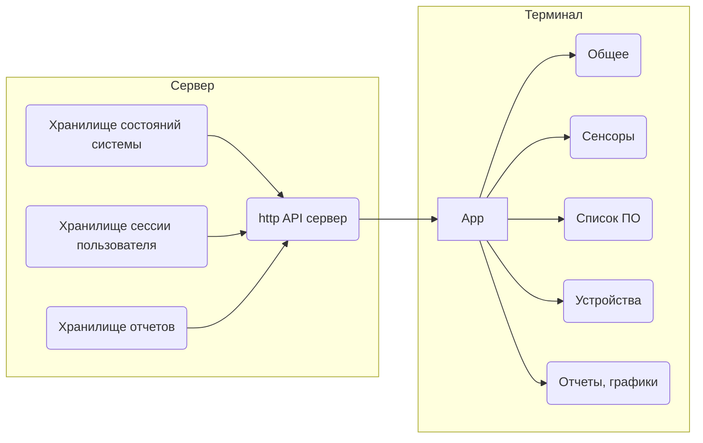

# Tss draft

Внутри mam надо создать папку mpk/tss и положить в нее содержимое гита

```mermaid
graph LR

subgraph Терминал
	Summary(Общее)

	Sensors(Сенсоры)

	Software(Список ПО)

	Units(Устройства)

	Reports(Отчеты, графики)

	App --> Sensors
	App --> Software
	App --> Units
	App --> Summary
	App --> Reports
end

subgraph Сервер
	ReportStorage(Хранилище отчетов)
	TCStorage(Хранилище состояний системы)
	SessionStorage(Хранилище сессии пользователя)
	API(http API сервер)

	TCStorage --> API
	SessionStorage --> API
	ReportStorage --> API
end

API --> App
```
